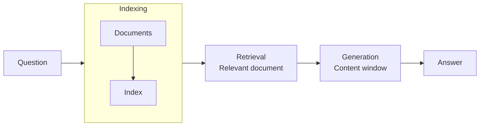
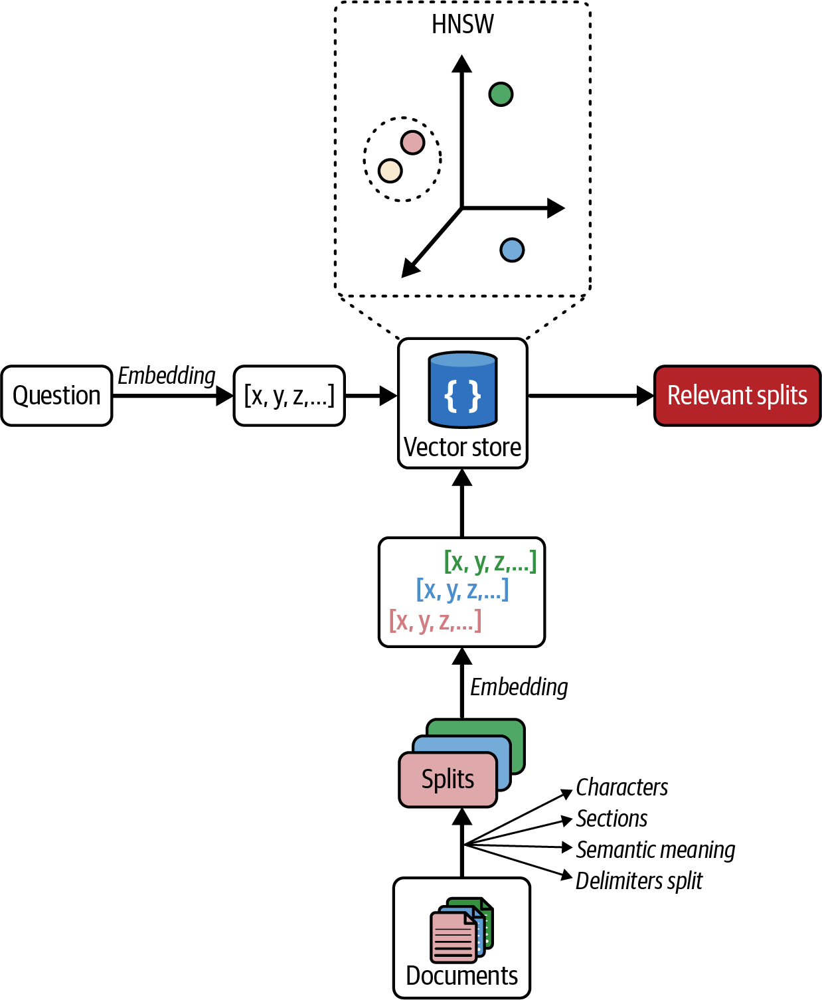
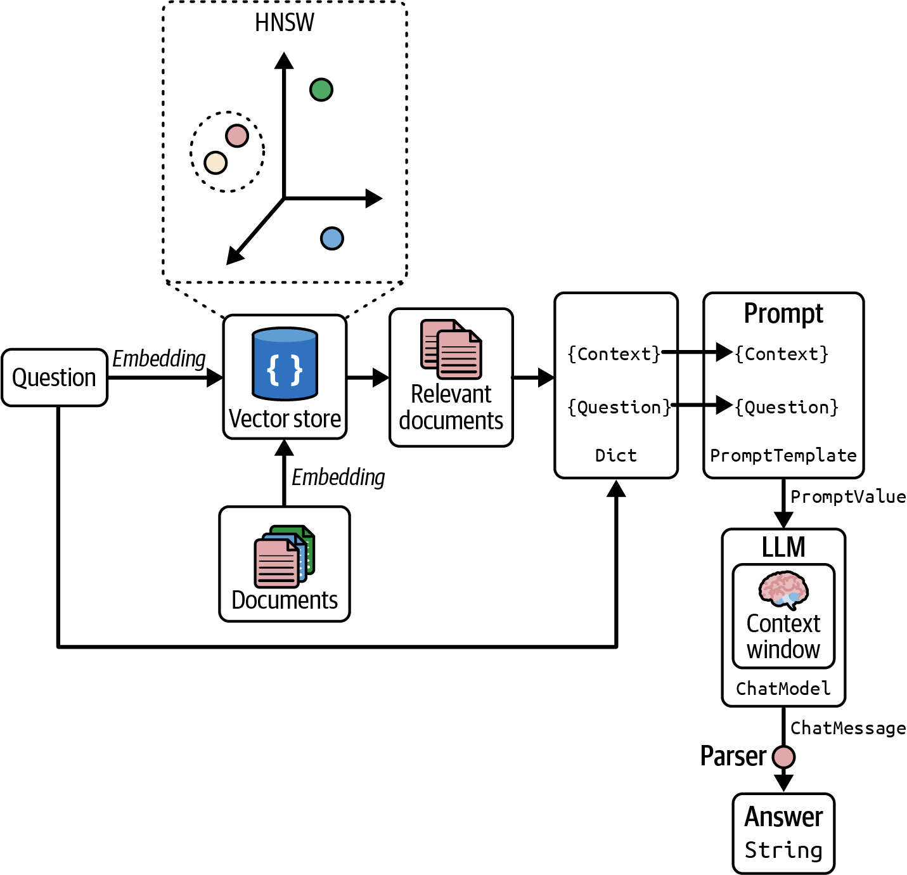
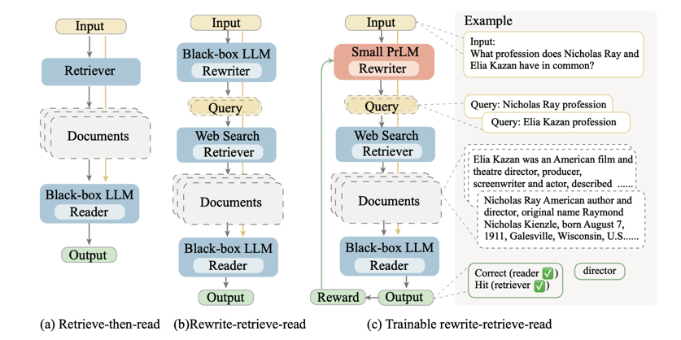
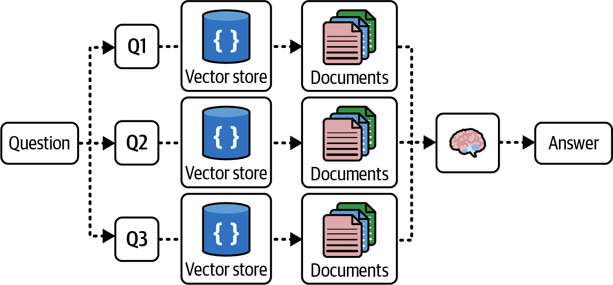
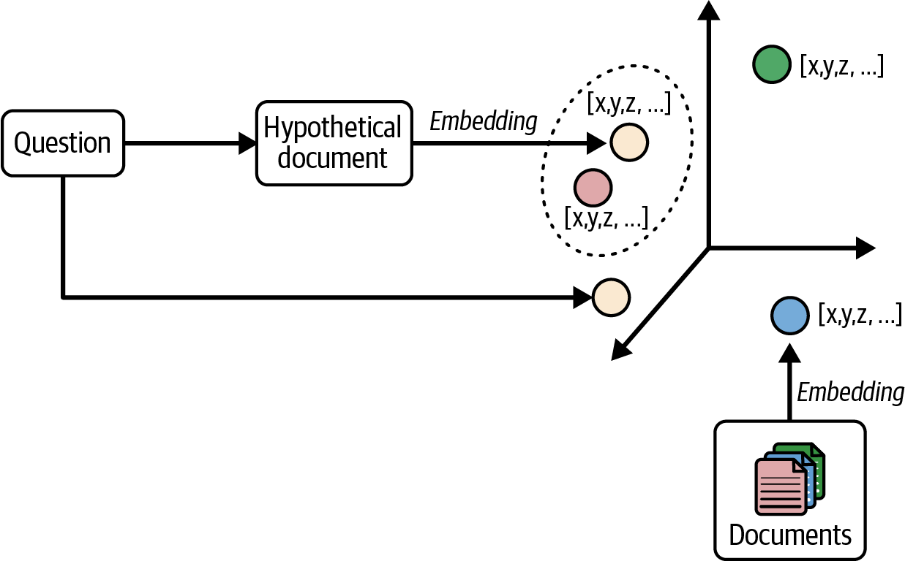
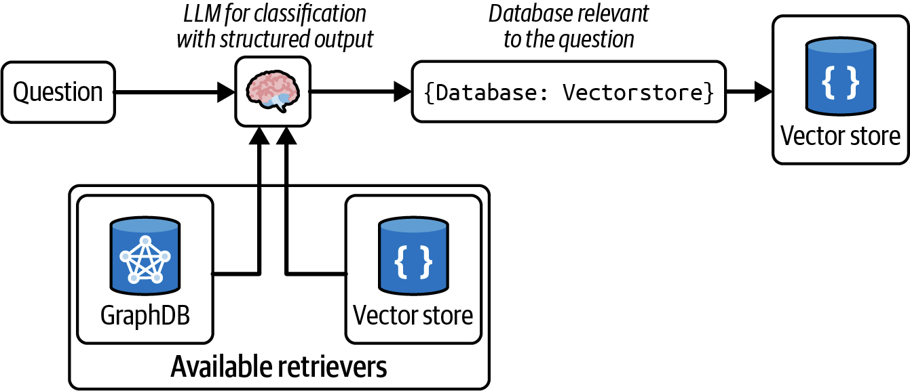
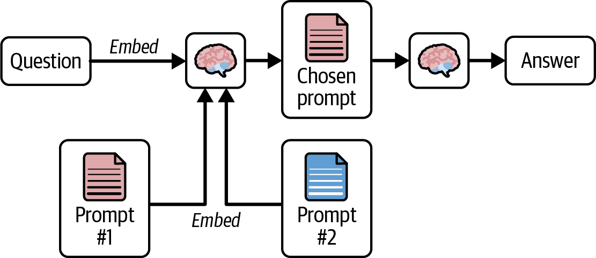

# RAG - Retrieval and Generation

## Retrieval Process

## Generation Process

## Building Production Grade RAG System
A production grade RAG system must solve for below questions.
- How do we handle the variability in the quality of a user’s input?  _(see Query Transformation)_
- How do we route queries to retrieve relevant data from a variety of data sources?
- How do we transform natural language to the query language of the target data
source?
- How do we optimize our indexing process, i.e., embedding, text splitting?

### Query Transformation: Rewrite-Retrieve-Read 

### Query Transformation: Multi-Query Retrieval

### Query Transformation: Hypothetical Document Embeddings

### Query Routing: Logical

### Query Routing: Semantic

